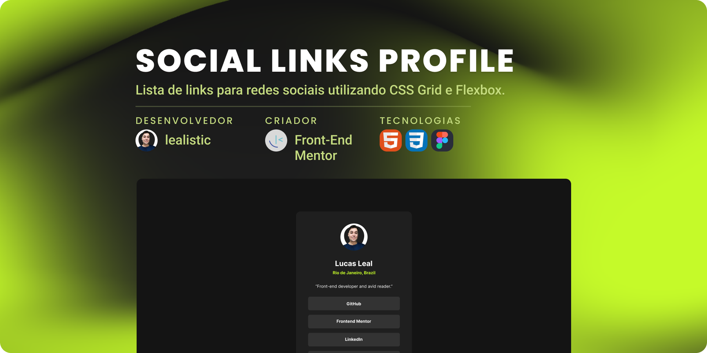

<h1 align="center">Social Links Profile</h1>

<!--Pontos de Navegação-->

  <a href="#-tecnologias">Tecnologias</a>&nbsp;&nbsp;&nbsp;|&nbsp;&nbsp;&nbsp;
  <a href="#-projeto">Projeto</a>&nbsp;&nbsp;&nbsp;|&nbsp;&nbsp;&nbsp;
  <a href="#memo-licença">Licença</a>

  

 

  

## 🚀 Tecnologias

Esse projeto foi desenvolvido com as seguintes tecnologias:

📌 HTML5
📌 CSS3
📌 Figma

## 💻 Projeto

Desafio prático do Front-End Mentor que consistiu na criação de uma lista de links para redes sociais utilizando **CSS Grid** para alinhamento e **Flexbox** para o layout dos itens. Durante o processo:

✔ **Figma** para reproduzir o layout com base em uma imagem de referência;

✔ **HTML Semântico** para melhor estruturação;

✔ **Grid e Flexbox** para um design responsivo e alinhamento preciso;

✔ **Variáveis CSS** com seletor `:root` para facilitar a manutenção e personalização;

✔ **Acessibilidade** aprimorada com atributos como `aria-label` para compatibilidade com leitores de tela.

🔗 [Link para acesso ao desafio](https://www.frontendmentor.io/challenges/social-links-profile-UG32l9m6dQ)

🔗 [Acesse o projeto finalizado, online](https://lealistic.github.io/fdmentor-profilelinks/)

## 📝 Licença

Esse projeto está sob a licença MIT.
